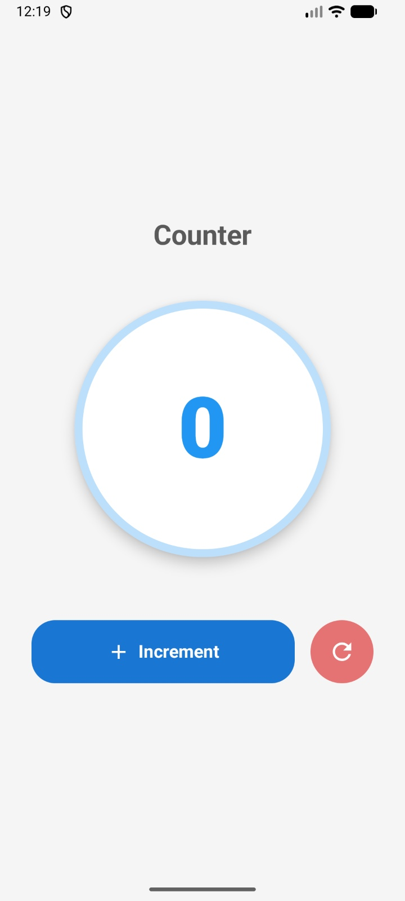
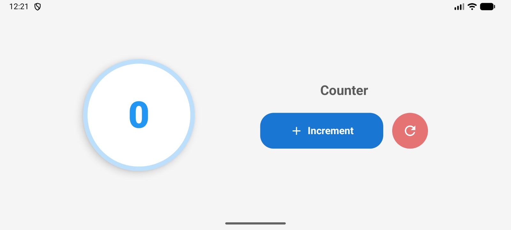

# README

## Student Information
- Name: Ashish Joshi  
- Assignment: Midterm Exam (Q1 - Compose State & Recomposition)  

---

## Overview
This task implements a simple counter screen using Jetpack Compose. The screen displays a number starting from 0 and provides buttons to increment and reset the value. The UI updates automatically when the state changes and persists across screen rotation.

---

## Features
- Displays a counter starting at **0**
- **Increment button** increases the count by 1
- **Reset button** sets the count back to 0
- UI automatically updates using Compose recomposition
- State survives screen rotation using `rememberSaveable`

---

## State Management
The counter is implemented using:
- `rememberSaveable`
- `mutableStateOf`

This ensures:
- Automatic UI recomposition when the value changes
- Persistence of state during configuration changes (e.g., screen rotation)

---

## Approach
- `CounterScreen()` manages the state (`count`)
- `CounterDisplay()` shows the current count inside a circular UI
- `ControlButtons()` handles Increment and Reset actions
- Layout adapts to both portrait and landscape using `LocalConfiguration`

---

## Screenshots

### Portrait Mode

### Landscape Mode

---

## Testing
- Verified increment functionality
- Verified reset functionality
- Verified UI updates correctly on every state change
- Verified state persistence after screen rotation

---

## Assumptions
- Input is controlled via buttons only (no invalid input cases)
- No negative values are required

---

## AI Usage Disclosure
ChatGPT was used to:
- Help debug minor errors
- Assist with formatting and structuring the README
- Review the solution for correctness

All implementation, logic, and final code were written and understood by me.

---

## 💬 Final Note
The solution was completed within the 90-minute time constraint, focusing on correctness, state management, and responsive UI behavior.
